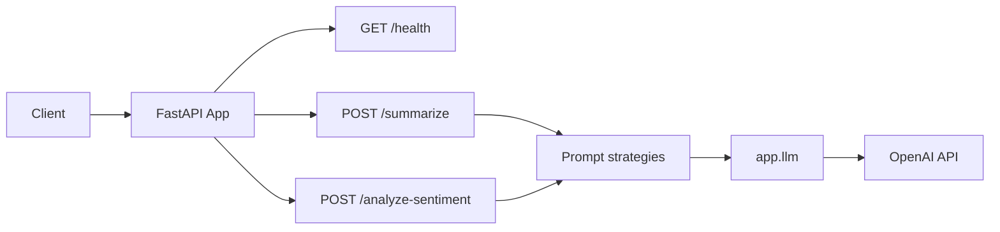

# ai-engineering-bootcamp-FastAPI Readme

**A FastAPI service that exposes text summarization and sentiment analysis via configurable LLM prompt strategies.**

---

## Why This Exists

Teams need a simple, deployable API to run summarization and sentiment analysis without wiring LLM calls from scratch. This project provides ready-made endpoints with multiple prompting approaches (zero-shot, few-shot, chain-of-thought, meta) so you can compare strategies and ship quickly. It exists to demonstrate production-style API design, prompt engineering, and cloud deployment (Render) from the Maven AI Engineering bootcamp.

---

## Architecture



- **Client** → **FastAPI** handles CORS and routing.
- **Health** returns status and timestamp; **Summarize** and **Analyze-sentiment** dispatch by `prompt_type` to **Prompt strategies**, which build messages for **app.llm**.
- **app.llm** calls **OpenAI** Chat Completions and returns text (or errors).

---

## Key Features

- **GET /health** – Health check with status and UTC timestamp.
- **POST /summarize** – Summarize text with optional `max_length`; supports four prompt types: `zero_shot`, `few_shot`, `chain_of_thought`, `meta`.
- **POST /analyze-sentiment** – Sentiment (positive/negative/neutral), confidence score (0–1), and explanation; same four prompt strategies.
- **Structured responses** – Pydantic models for request/response validation and OpenAPI docs.
- **Env-based config** – `OPENAI_API_KEY` and optional `OPENAI_MODEL` via `.env` or environment.

---

## Tech Stack

| Layer        | Technology     | Why                                                                 |
|-------------|----------------|---------------------------------------------------------------------|
| API         | FastAPI        | Async, automatic OpenAPI docs, request/response validation.          |
| Server      | Uvicorn        | ASGI server used for local and Render runs.                        |
| LLM         | OpenAI API     | Chat Completions for summarization and sentiment.                   |
| Validation  | Pydantic       | Request/response schemas and type-safe config.                     |
| Env         | python-dotenv  | Load `.env` for local `OPENAI_API_KEY` without exporting.            |
| Deploy      | Render         | Git-based deploys, Python runtime, env secrets.                    |

---

## How to Deploy

### Run locally (zsh)

From the project root:

```bash
# Create and activate virtual environment
python3 -m venv .venv
source .venv/bin/activate

# Install dependencies
pip install -r requirements.txt

# Set API key (or add to .env: OPENAI_API_KEY=...)
export OPENAI_API_KEY=your-openai-key

# Start the server
uvicorn main:app --reload
```

- API: http://127.0.0.1:8000  
- Docs: http://127.0.0.1:8000/docs  

Optional: add a `.env` file with `OPENAI_API_KEY=...` (and optionally `OPENAI_MODEL=...`); the app loads `.env` on startup.

### Deploy on Render

1. Push this repo to GitHub and connect the repo to [Render](https://render.com).
2. Create a new **Web Service**. Render can use `render.yaml` or you can set:
   - **Build command:** `pip install -r requirements.txt`
   - **Start command:** `uvicorn main:app --host 0.0.0.0 --port $PORT`
3. In the service **Environment** tab, add **OPENAI_API_KEY** as a Secret.
4. Deploy. The API is available at the service URL (e.g. `https://ai-bootcamp-api.onrender.com`).

See [Deploy a FastAPI app on Render](https://docs.render.com/deploy-fastapi) for more.

---

## Project Structure

```
ai-engineering-bootcamp/
├── main.py                 # FastAPI app, CORS, router includes, load_dotenv
├── requirements.txt        # fastapi, uvicorn, openai, pydantic, python-dotenv
├── render.yaml             # Render Blueprint (build/start, env reference)
├── .env                    # Local env (OPENAI_API_KEY, OPENAI_MODEL); not committed
├── .gitignore
├── README.md
└── app/
    ├── __init__.py
    ├── llm.py              # OpenAI client wrapper (complete, get_model)
    ├── routes/
    │   ├── __init__.py
    │   ├── health.py       # GET /health
    │   ├── summarize.py    # POST /summarize
    │   └── sentiment.py    # POST /analyze-sentiment
    └── prompts/
        ├── __init__.py
        ├── summarize.py    # Four summarization prompt builders
        └── sentiment.py   # Four sentiment prompt builders
```
