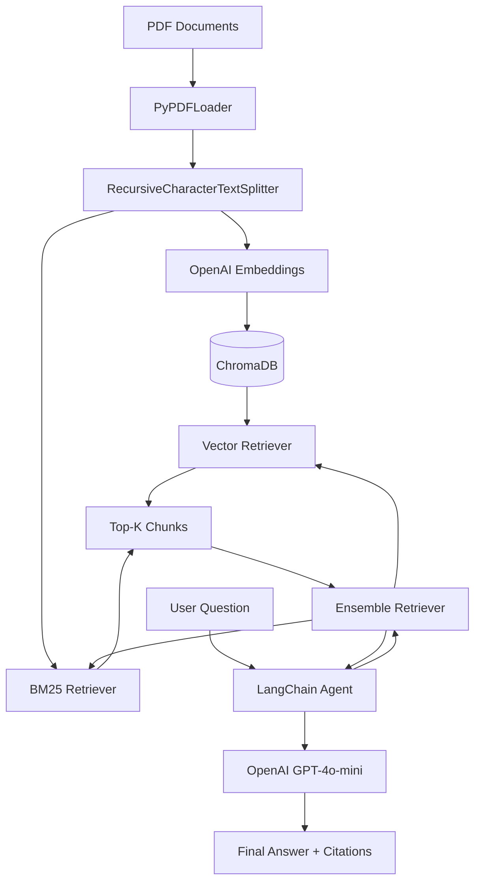

# RAG-Powered Q&A System

This project implements a Retrieval-Augmented Generation (RAG) system designed to answer questions based on a collection of PDF documents (e.g., NetWitness UEBA User Guide, FIA 2026 F1 Regulations). It uses modern LangChain patterns to build a robust, citation-aware Q&A agent.

---

## Architecture

The system follows a standard RAG pipeline enhanced with an agentic approach for retrieval:



1.  **Ingestion Phase**: 
    - **Loading**: PDF files are loaded from the `documents/` folder using `PyPDFLoader`.
    - **Chunking**: Text is split into chunks (1000 characters with 300 character overlap) using `RecursiveCharacterTextSplitter`.
    - **Embedding**: Each chunk is converted into a high-dimensional vector using OpenAI's `text-embedding-3-small` model.
    - **Vector Store**: Embeddings and metadata are stored in a persistent **ChromaDB** instance.
    - **BM25 Index**: Chunks are also indexed for keyword-based search using **BM25Retriever**.

2.  **Retrieval & Generation Phase**:
    - **Hybrid Search**: The system uses an **Ensemble Retriever** to combine vector similarity (weight: 0.4) and keyword search (weight: 0.6).
    - **Agentic Logic**: A LangChain agent uses a custom `@tool` to interact with the ensemble retriever.
    - **Context Injection**: The most relevant document chunks are retrieved and provided to the LLM.
    - **Response Generation**: The LLM (GPT-4o-mini) synthesizes an answer based strictly on the retrieved context, ensuring accuracy and providing citations.

---

## Key Features

-   **Multi-PDF Support**: Automatically processes all PDF files within the `documents/` directory.
-   **Persistent Vector Database**: Saves embeddings locally in `rag_vector_db/`, avoiding redundant API calls and processing time on subsequent runs.
-   **Modern LangChain Patterns**: Utilizes the latest `create_agent` and `@tool` decorator patterns for a clean and extensible codebase.
-   **Source Attribution**: The agent is configured to cite specific sources and pages from the original documents in its responses.
-   **Robust PDF Parsing**: Configured to handle common PDF structural issues gracefully.

---

## Tech Stack

| Component         | Technology                     | Description                                         |
|-------------------|--------------------------------|-----------------------------------------------------|
| **Orchestration** | LangChain                      | Framework for developing LLM-powered applications.  |
| **LLM**           | OpenAI GPT-4o-mini             | Fast, cost-effective model for reasoning and synthesis.|
| **Embeddings**    | OpenAI text-embedding-3-small  | High-performance text vectorization.                |
| **Vector DB**     | ChromaDB                       | Open-source vector database for AI-native apps.     |
| **Hybrid Search** | rank-bm25 / EnsembleRetriever | Combines vector similarity with keyword-based search. |
| **PDF Parsing**   | pypdf                          | Pure-python PDF library for text extraction.        |
| **Environment**   | Jupyter Notebook / Python      | Interactive development and execution environment.  |

---

## Evaluation

The system was evaluated for accuracy and retrieval quality:
- **Accuracy**: 4/5 for retrieval, faithfulness, and correctness.
- **Observation**: Performance improved with larger chunk sizes (1000/300) and hybrid search, though context confusion can occur between different document types.

---

## Getting Started

1.  Place your PDF documents in the `documents/` folder.
2.  Configure your `OPENAI_API_KEY` in a `.env` file within this directory.
3.  Install dependencies:
    ```bash
    pip install langchain langchain-openai langchain-community langchain-text-splitters langchain-classic chromadb pypdf python-dotenv rank-bm25
    ```
4.  Run the `build-your-own-q&a.ipynb` notebook to index documents and start asking questions.
